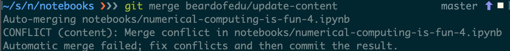
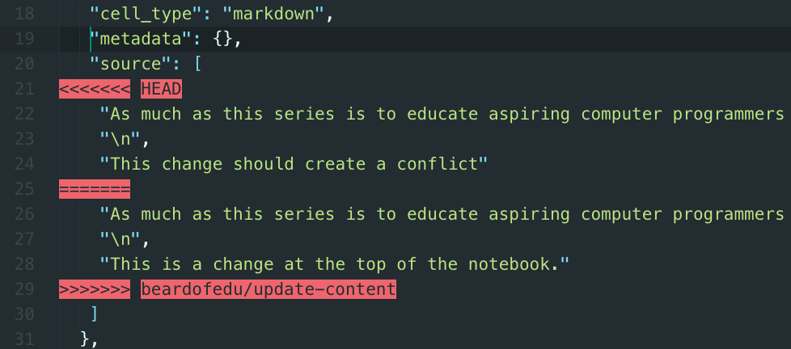
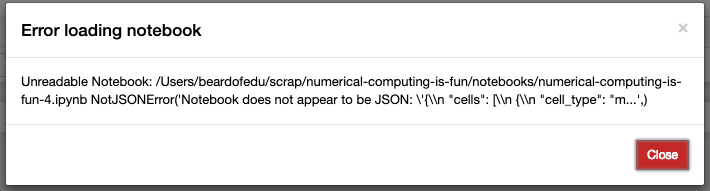

## Handling merges

Based on the suggested workflow at BCG Gamma, you shouldn't be surprised by a merge conflict at it will be displayed on the pull request on GitHub. However, if you try to update your local feature branch with an updated `master` branch you may encounter a merge conflict. Encountering a merge conflict in the command line will look something like this:

Opening a `.ipynb` file inside of a text editor will help you identify where the conflict is within a file. Later in the course we will identify how to resolve a merge conflict, this section focuses specifically on the experience of handling merge conflicts in your notebook file.

A merge conflict, regardless of how complex will always contain specific conflict markers. An example of a notebook file with conflict markers will look like this:

The conflict markers used by Git will cause an error if you try to load a notebook, so the conflict must be resolved in an external text editor.

### My notebook isn't loading

One way to find out you have a conflict in a Jupyter Notebook is when the following error is displayed when you try to open a notebook.

This type of error should not be encountered often, unless the merge conflict markers are not removed from the notebook file during the resolution of the merge conflict.
